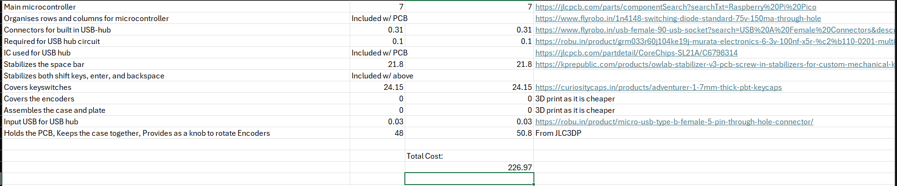

### Entry 5: Hunting for Parts & The CSV BOM
* **Time Spent:** 1 hr
* **Date:** August 26, 2026

**What I did:**
scoured the internet for the absolute cheapest components because we are on a strict budget here. tracked down all the specific switches, diodes, keycaps, and the MCU i need for the 75% layout. compiled the whole thing into a list [and yes, i made sure to export it as a `.csv` this time so i don't get yelled at]. 

**What I got stuck on:**
mostly just trying not to accidentally spend $200 on fancy keycaps i don't actually need.

**Visual Progress:**

*(Make sure to upload your BOM as a .csv file to the repo!)*

### Entry 4: 3D Modeling the Case (The All-Nighter Part 2)
* **Time Spent:** 3.5 hrs
* **Date:** August 24, 2026

**What I did:**
still running on zero sleep from the PCB routing. moved onto the 3d case. 3d modeling is basically black magic to me, so my friends lectured me while i aggressively googled methods. i used a few existing open-source models as a baseline reference to figure out how to build the outer walls and standoffs for the pcb to actually sit on. honestly, i'm very proud of how this turned out [though maybe that's just the sleep deprivation talking]. done with pcb and case!

**What I got stuck on:**
figuring out clearances so the pcb actually fits inside the plastic case instead of just clipping through it. watching tutorials at 3 am is an experience.

**Visual Progress:**

*(Tip: Add a screenshot of the case wireframe or your CAD software interface here if you have one)*

### Entry 3: Redesign & PCB Routing (The All-Nighter Part 1)
* **Time Spent:** 4 hrs
* **Date:** August 24, 2026

**What I did:**
invited 2 friends over who know 3d modeling and electrical stuff because misery loves company. they took one look at my 60% plan and convinced me to ditch it for a 75% layout with more keys and 2 knobs [rotary encoders, fancy i know]. i had to redo the entire schematic matrix for the new keys and then spent hours actually routing the pcb. drawing those traces is basically like playing snake, except if you cross a line your keyboard shorts out. finished the silkscreen too. 

**What I got stuck on:**
having to scrap my original 60% matrix and re-wire everything in kicad for the 75% layout. so much wire spaghetti.

**Visual Progress:**

### Entry 2: Schematics & The KiCad Nightmare
* **Time Spent:** 4 hrs
* **Date:** August 23, 2026

**What I did:**
downloaded kicad first thing in the morning and tried reading the official docs side by side [worst mistake, they are incredibly vague]. gave up and spent 3 solid hours binging youtube tutorials instead to learn how to assign footprints. placed the switch matrix, diodes, and MCU in the schematic. the sheer amount of work i put into the schematic almost made me pass out so i called it a day right as i generated the netlist. 

**What I got stuck on:**
knowing what everything actually does and what footprints to select. thanks to a random youtube guy who saved me as i was on the verge of throwing my laptop away. (note to hack club: please provide detailed guides because things got really problematic).

**Visual Progress:**
 
 

### Entry 1: Completing the Planning Module
* **Time Spent:** 1.5 hours
* **Date:** August 22, 2026

**What I did:**
since the official planning module didn't exactly spoon-feed me specific steps, i had to google my way to victory and found industry-standard layout tools like SwillKb. mapped out my keyboard array on Keyboard Layout Editor. originally chose a 60% configuration to save desk space (spoiler: that changes later). after tweaking the design, i exported the raw layout coordinates and ran them through Swillkb Plate Builder to generate a physical DXF blueprint. committed the raw text and DXF to the repo.

**What I got stuck on:**
understanding stabilizer key spacing (like how big to make the Enter or Space keys relative to normal 1u keys) took some annoying trial and error, but reviewing community standard layouts on KLE fixed it.

**Visual Progress:**

