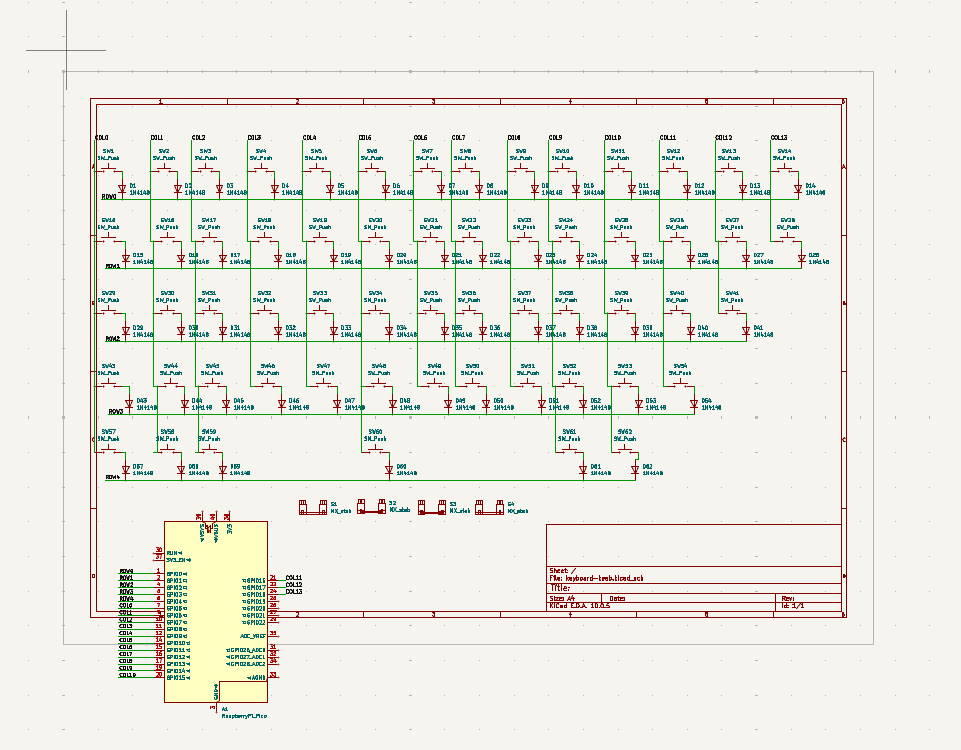
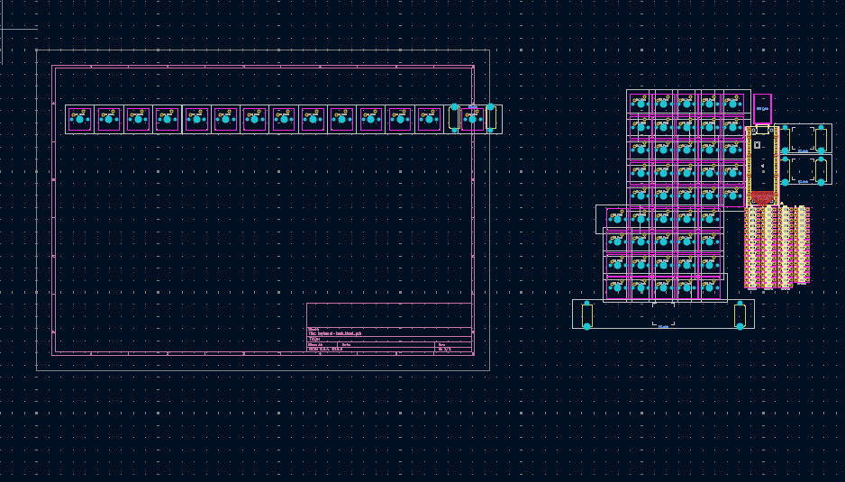

## Build Journal

### Entry 4: Completed BOM
* **Time Spent:** 1 hr
* **Date:** August 26, 2026

**What I did:**
I researched all of the components and found the cheapest prices all over and created the BOM list.

### Entry 3: Completed PCB and 3D Case
* **Time Spent:** 7 hrs 30mins
* **Date:** August 24, 2026

**What I did:**
This is the entry till now I can say I'm very proud of. I called my 2 friends who have great knowledge of 3D Modelling and Electrical things for a night out and we spent the entire night creating the keyboard. And yeahh I did change the Schematic and PCB again from a 60% to a 75% keyboard with more keys and 2 knobs, on their advice. I used a few of the already existing models to help me in the modelling of the case. I am completely done with the PCB and Case. The only things left are BOM and Firmware. I hope everything goes well and I wish you do so too.

**What I got stuck on:**
Of course, 3D modelling was a new domain for me, so I had to watch quite a few videos, lectures from my friend and Google methods but overall it was quite fun.

**Visual Progress:**

### Entry 2: Creating Schematics and PCB
* **Time Spent:** 3.5-4hrs
* **Date:** August 23, 2026

**What I did:**
So I downloaded KiCad first thing in the morning and hopped on reading the docs side by side. But again, since the documents are so vague, I went on YouTube and spent 3 hours learning KiCad. Then I ended up changing my entire keyboard layout plan. (Please provide detailed guides because things got really problematic). But as always in the end everything worked out and I completed the Schematic and got to the PCB and spent some time, but sheer amount of work I had put into the schematic almost made me pass out so I called it a day. 

**What I got stuck on:**
Knowing what everything actually does and what to select and why was very confusing. Thanks to a YouTube video which helped out as I was on the verge of giving up. 

**Visual Progress:**
 
 

### Entry 1: Completing the Planning Module
* **Time Spent:** 1 and half hour = 1.5 hours
* **Date:** August 22, 2026

**What I did:**
Since the official planning module didn't provide specific steps, I used industry-standard layout tools such as SwillKb, which I found through Google research. I mapped out my keyboard array on Keyboard Layout Editor. I chose a 60% configuration to maximize desk space. After tweaking the design, I exported the raw layout coordinates and ran them through Swillkb Plate Builder to generate a physical DXF blueprint file. I have successfully committed the raw text data and DXF file to this repository.

**What I got stuck on:**
Understanding stabilizer key spacing (like how big to make the Enter or space keys relative to normal 1u keys) took some trial and error, but reviewing community standard layouts on KLE helped me align everything correctly.

**Visual Progress:**

