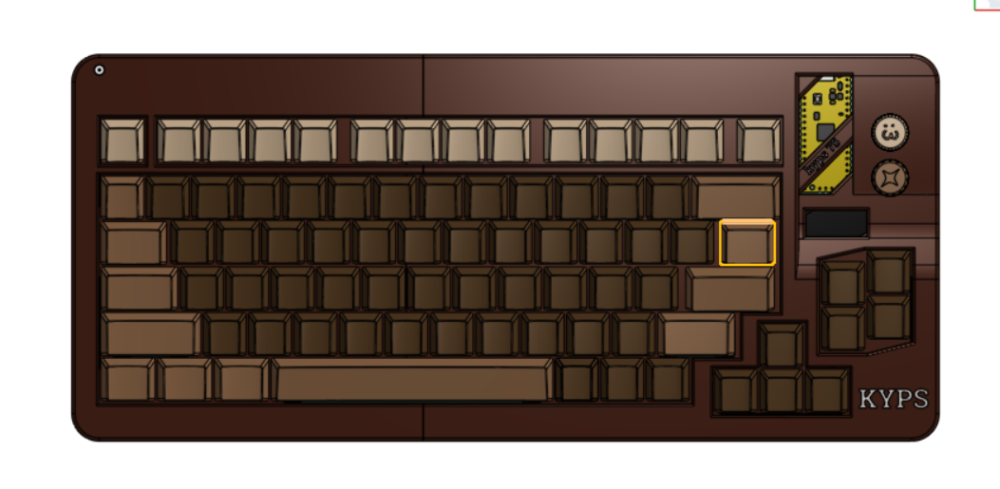

# KYPS75

## Project Goals
* **Target Layout:** 75% 
* **Design Philosophy:** after changing this quite a few times, i finally found the perfect size for my desk [with one of my favourite colors on it, obviously].
* **Why I'm building this:** well, i have a knack for building things from scratch and i have been planning to buy a keyboard... making it myself literally can't be any better.
* **What I have learned:** (to be updated at the end of my build once i survive this)

* Here are some images of my build:
  
  
  
  
  

*Note: Firmware is not yet built because it entirely depends on how the actual parts assemble and feel on my desk (i know it sounds very weird but trust me on this).*
